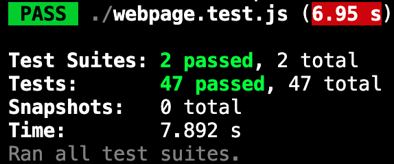
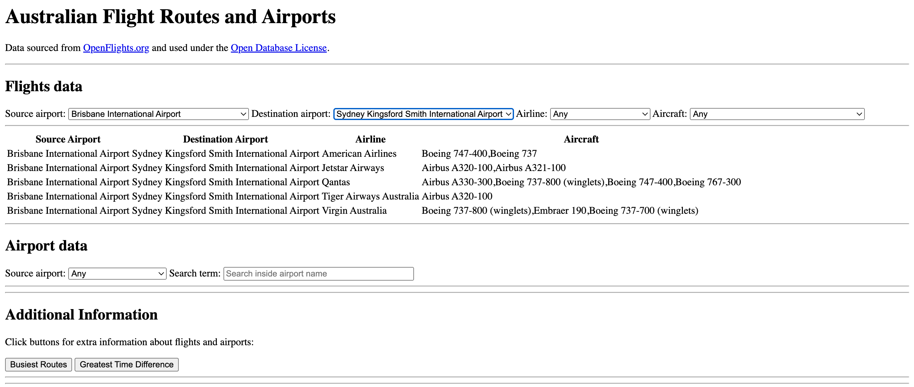
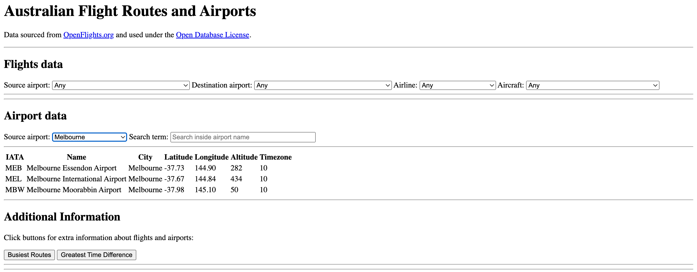
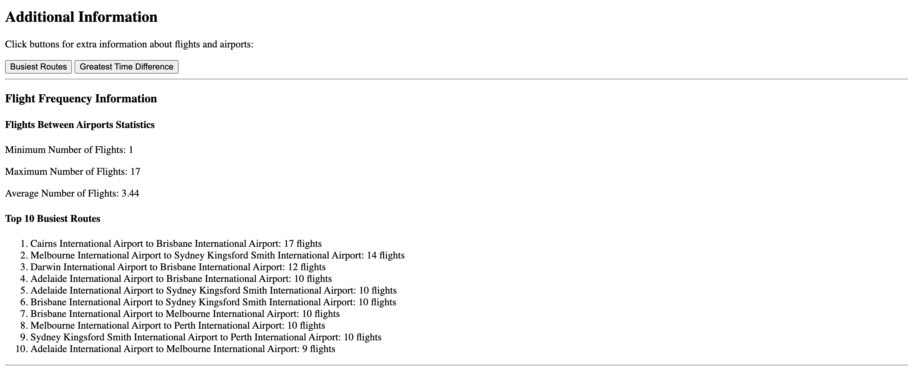
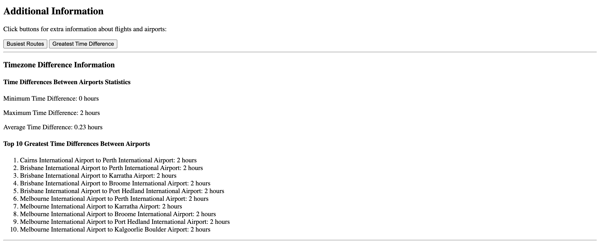

# Overview
This project demonstrates the use of JavaScript, Node.js, and HTML to create a basic web page that allows for the analysis and filtering of flight and airport data. The web page interacts with two datasets containing flight and airport information from OpenFlights, enabling users to explore flight data and view relevant statistics.

# Features
- Data Loading: Downloads and merges flight and airport datasets.
- Mapping Function: Allows modifications across the dataset with timestamp tracking.
- Data Analysis: Functions to filter, analyze, and calculate statistics on the flight data.
- Interactive Web Page: Users can filter flights, view summaries, and display statistics using dropdowns and buttons.
- Unit Testing: Comprehensive tests to ensure the functions behave correctly.
- Functional JavaScript: Emphasis on pure functions and immutability.

# Setup
## Prerequisites
- Node.js
- npm (Node package manager)

## Installation
1. Clone the repository:
```
git clone <repository-url>
cd <project-folder>
```
2. Install the dependencies:
```
npm install
```
3. Open the `index.html` file in your browser or use a local server to view the web page.

# How It Works
## Step 1: Loading Data
The flight and airport datasets are loaded asynchronously using `fs.readFileSync` and parsed into JSON objects. The datasets are then merged by matching airport IDs from the flight data with those in the airport dataset. The resulting merged data allows easy analysis without needing to reference the separate datasets.

## Step 2: Mapping Function
A `mapData` function is created to iterate over the combined dataset and apply a modification function to each item. A timestamp is added to track when the data was last modified. The function does not alter the original dataset, ensuring immutability.

## Step 3: Data Analysis
Several filtering and analysis functions are created, including:
- Filtering: Functions to filter flights based on criteria like source airport, destination airport, airline, aircraft type, and codeshare status.
- Airport Pairs: Functions to calculate the time differences and number of flights between airport pairs.
- Statistics: Functions to calculate the minimum, maximum, average, and top 10 values for flight counts and time differences.

## Step 4: Interactive Web Page
The provided HTML page includes dropdowns and buttons to interact with the data. JavaScript is used to populate the dropdowns, filter the data, and display results in a table format. The page also displays summary statistics like the top 10 busiest routes and the greatest time differences.

## Step 5: Unit Tests
Unit tests are written using Jest to validate the functionality of the various functions. Tests cover a wide range of inputs, including edge cases and error handling. The results indicate that all tests pass successfully.

## Step 6: Functional JavaScript
While not all code is written in a purely functional style, the core functions adhere to principles of immutability and pure functions. The project demonstrates functional programming concepts in JavaScript, such as avoiding side effects and ensuring predictable outputs.

# Running the Project
1. Fetch flight and airport data:
    - The fetchFlightData function loads the data from JSON files and merges the datasets.
    - It then calculates relevant statistics and populates dropdown menus for user interaction.
2. Use the web page:
    - Users can filter the data by selecting criteria from the dropdowns.
    - Summary statistics can be displayed by pressing the buttons below the filtering options.
3. Analyze the results:
    - The web page dynamically updates with results for flights matching the selected criteria.
    - Summary statistics (e.g., busiest routes, time zone differences) are displayed based on the analysis.

# Testing
Unit tests are included in the project and cover various functions for data processing and web interaction. To run the tests:
1. Ensure Jest is installed:
```
npm install --save-dev jest
```
2. Run the tests:
```
npm test
```
All functions are tested to ensure that they handle various inputs and edge cases correctly.



# Webpage Screenshots
Website flight filtering example:


Website airport data example:


Website Flight Frequency Facts:


Website Timezone Differences Facts:


# Conclusion
This project showcases how JavaScript can be used to load, manipulate, and analyze data in a web page. The use of functional programming principles helps maintain clean and predictable code, while the interactive features provide users with the ability to explore the dataset and view useful statistics.